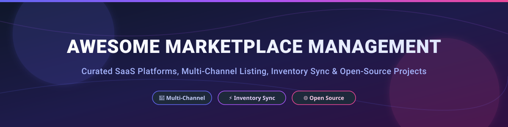

# 🛒 Awesome Marketplace Management 🚀

  
  
  
  

> **A Curated Directory & Ecosystem Guide for SaaS Marketplace Management Platforms, Open-Source Multi-Vendor Frameworks, Inventory & Listing Sync Tools, and Omnichannel Commerce Operations.** 📊 Hub for sellers, e-commerce engineers, and marketplace ops.

---

## 📚 Table of Contents
- [🌐 Market Size & Industry Structure](#-market-size--industry-structure)
- [🏢 SaaS & Commercial Platforms](#-saas--commercial-platforms)
- [🔓 Open-Source GitHub Projects](#-open-source-github-projects)
- [🤝 How to Contribute](#-how-to-contribute)
- [⚠️ Disclaimer](#%EF%B8%8F-disclaimer)
- [💖 Support & Sponsorship](#-support--sponsorship)
- [📈 Star History](#-star-history)

---

## 🌐 Market Size & Industry Structure

> 💡 **Market Size & Overview:** The global e-commerce marketplace management software market is estimated at **$3.5 Billion in 2026** (projected to reach **$7.8 Billion by 2032** growing at a CAGR of ~14.2%).
> 
> 🧩 **Market Fragmentation:** The sector is **moderately fragmented**. High enterprise complexity, regional marketplace variations (e.g., Mercado Libre, Shopee, Allegro), and specialized integration requirements prevent a "winner-take-all" dynamic, allowing key enterprise players (Rithum, ChannelEngine, Productsup) and agile mid-market tools (Linnworks, Sellercloud, CedCommerce) to thrive side-by-side.

---

## 🏢 SaaS & Commercial Platforms

Top multi-channel marketplace listing, inventory sync, and order management platforms, ordered by estimated market valuation and enterprise annual revenue (descending).

| Platform | Company Size (Valuation / Est. Revenue) 💰 | Starting Pricing Tier 🏷️ | Free Tier / Free Trial Limit 🎁 | Description & Core Focus 🎯 |
| :--- | :--- | :--- | :--- | :--- |
| **[ChannelAdvisor (Rithum)](https://www.channeladvisor.com/)** 🏢 | **~$1.0B Valuation** (~$200M+ Annual Revenue) | Starting at **$2,000 / month** (plus GMV-based commission fees) | **No Free Trial** (Custom enterprise demo & paid trial on request) | Premier enterprise multi-channel management software for global brands operating across Amazon, eBay, Walmart, and 300+ channels. |
| **[Productsup](https://www.productsup.com/)** 🚀 | **~$500M Valuation** (Series B $70M+, ~$50M Revenue) | Custom enterprise tiers starting at **$1,500 / month** | **14-day Free Trial** (Limited to 1,000 product SKUs feed test) | Product data syndication & feed management platform for enterprise catalog optimization across 2,500+ shopping channels. |
| **[ChannelEngine](https://www.channelengine.com/)** ⚡ | **~$250M Valuation** (Series B $50M+, ~$35M Revenue) | Starting at **$600 / month** (plus variable success fee based on GMV) | **14-day Free Trial** (Sandbox environment with mock marketplace channels) | Advanced marketplace automation platform synchronizing catalog, stock, and orders with 1,300+ global marketplaces. |
| **[Linnworks](https://www.linnworks.com/)** 📦 | **~$200M Valuation** (~$40M Annual Revenue) | Starting at **$449 / month** (Standard plan up to 1,000 monthly orders) | **14-day Free Trial** (Full feature access capped at 100 test orders) | Multi-channel inventory control, order management, and shipping fulfillment automation system. |
| **[Sellercloud](https://www.sellercloud.com/)** 🛒 | **~$100M Valuation** (~$25M Annual Revenue) | Starting at **$1,199 / month** (Includes base usage + per-transaction fees) | **30-day Free Trial** (Includes complete multi-channel inventory sync testing) | Comprehensive e-commerce operations manager covering multi-channel listing, inventory sync, WMS, and order fulfillment. |
| **[CedCommerce](https://cedcommerce.com/)** 🔌 | **~$30M Valuation** (~$10M Annual Revenue) | Per-channel app starting at **$19 / month** per marketplace connector | **7-day Free Trial** (Includes 50 imported orders & 100 SKU syncs) | Modular marketplace integration apps & connectors connecting Shopify, WooCommerce, and Magento to major marketplaces. |

---

## 🔓 Open-Source GitHub Projects

Curated open-source multi-vendor marketplace frameworks, headless commerce foundations, and developer tools, sorted by GitHub repository Stars_Counts (descending).

| Repository 📦 | GitHub_Stars ⭐ | Primary Use Case & Architecture 🏗️ | Key Features & Strengths 🌟 |
| :--- | :--- | :--- | :--- |
| **[medusajs/medusa](https://github.com/medusajs/medusa)** ⚡ |  | Headless Open-Source Commerce Engine | Node.js / TypeScript open commerce engine; customizable for multi-vendor and custom marketplace integrations. |
| **[bagisto/bagisto](https://github.com/bagisto/bagisto)** 🛍️ |  | PHP / Laravel Multi-Vendor Marketplace | Production-ready Laravel platform for multi-vendor marketplaces with vendor panel, commission tracking, and storefront. |
| **[saleor/saleor](https://github.com/saleor/saleor)** 🎨 |  | GraphQL-first Headless Commerce Framework | Python / Django + GraphQL ultra-fast headless platform easily extensible with custom channel & marketplace extensions. |
| **[woocommerce/woocommerce](https://github.com/woocommerce/woocommerce)** 🔌 |  | Open E-Commerce Platform & Ecosystem | World's most popular WordPress e-commerce framework with extensive open marketplace sync extensions. |
| **[PrestaShop/PrestaShop](https://github.com/PrestaShop/PrestaShop)** 🏪 |  | Modular PHP Commerce Platform | PHP open-source commerce solution featuring extensive community modules for Amazon, eBay, and Etsy listing. |
| **[vendurehq/vendure](https://github.com/vendurehq/vendure)** ⚙️ |  | Modern TypeScript / NestJS Commerce Framework | Headless GraphQL e-commerce framework built on Node.js/TypeScript designed for multi-channel seller extensions. |
| **[activemerchant/active_merchant](https://github.com/activemerchant/active_merchant)** 💳 |  | Ruby Payment & Commerce Integrations | Shopify-backed Ruby library abstracting payment gateways and commercial integrations. |
| **[mercurjs/mercur](https://github.com/mercurjs/mercur)** 🚀 |  | Open-Source B2B & B2C Marketplace Engine | Modern TypeScript/Next.js multi-vendor marketplace framework with admin portal, vendor dashboard, and storefront. |
| **[openmvm/OpenMVM](https://github.com/openmvm/OpenMVM)** 🌐 |  | PHP Multi-Vendor Core Engine | Open-source multi-vendor e-commerce software focused on multi-currency, multi-language, and vendor commission rules. |

---

## 🛠️ Open-Source Building Blocks & Developer Resources

- **[Amazon SP-API SDKs](https://github.com/search?q=Amazon+SP-API)**: Community-maintained libraries in Python, Node.js, and PHP for Amazon Selling Partner API.
- **[eBay REST API Client SDKs](https://github.com/search?q=eBay+API)**: Open-source developer SDKs for managing inventory, listings, and orders on eBay.
- **[Product Feed Transformers](https://github.com/search?q=product+feed+generator)**: Lightweight tools for transforming XML/JSON product catalogs into Google Shopping & marketplace formats.

---

## 🤝 How to Contribute

Contributions are welcome! Help expand this list by following these steps:

1. 🍴 **Fork** this repository.
2. 📝 **Add/edit** entries in `README.md` following the standard markdown table structure.
3. 🔎 **Provide details**: Name, GitHub/website link, pricing/stars, and accurate focus description.
4. 🚀 **Open a Pull Request** with a clear explanation of your additions.

---

## ⚠️ Disclaimer

- This repository is a **community-curated index** provided for informational purposes only.
- Marketplace operations involve strict third-party platform policies, API rate limits, and compliance obligations.
- Open-source platforms require ongoing infrastructure, maintenance, and security management, whereas SaaS platforms offer fully hosted support and pre-built integrations.

---

## 💖 Support & Sponsorship

If you find this repository helpful for your e-commerce architecture, marketplace engineering, or multi-channel operations, please consider supporting the project:

- ⭐ **Star this repository** to help others discover it!
- 🔀 **Fork & Share** with fellow developers and commerce teams.
- ☕ **Buy me a coffee / Sponsor:** [GitHub Sponsors Dashboard](https://github.com/sponsors/ishandutta2007)

Thank you for your support and contributions! ❤️

---

## 📈 Star History

